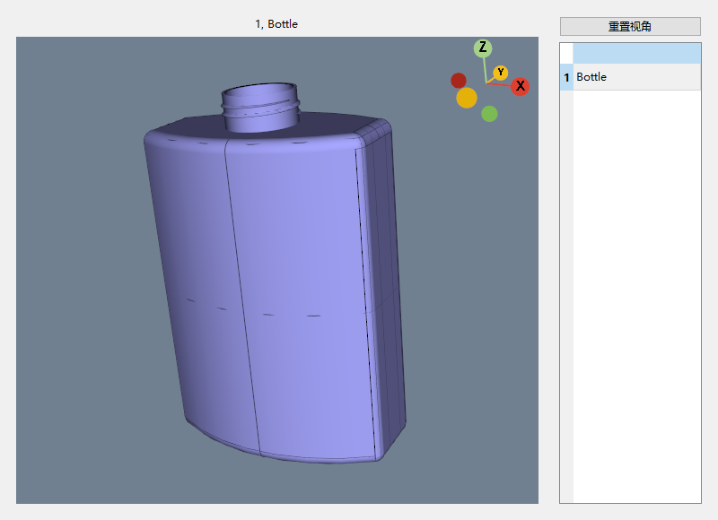
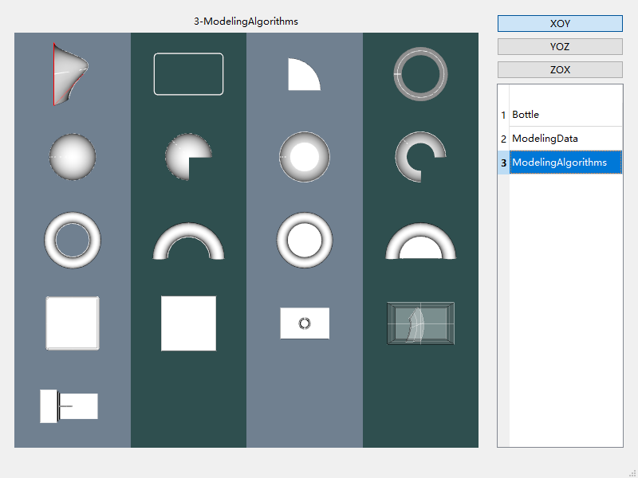

# Tip

[1-Bottle](#1-Bottle)

[2-ModelingData](#2-ModelingData)

[3-ModelingAlgorithms](#3-ModelingAlgorithms)

# 1-Bottle

[learn](./examples/readme_1二维曲线映射到3D曲面.md)

[回到顶部](#Tip)

# 2-ModelingData

[回到顶部](#Tip)

介绍一些概念

# 3-ModelingAlgorithms

[回到顶部](#Tip)

[拔模](./examples/readme_3拔模.md)

