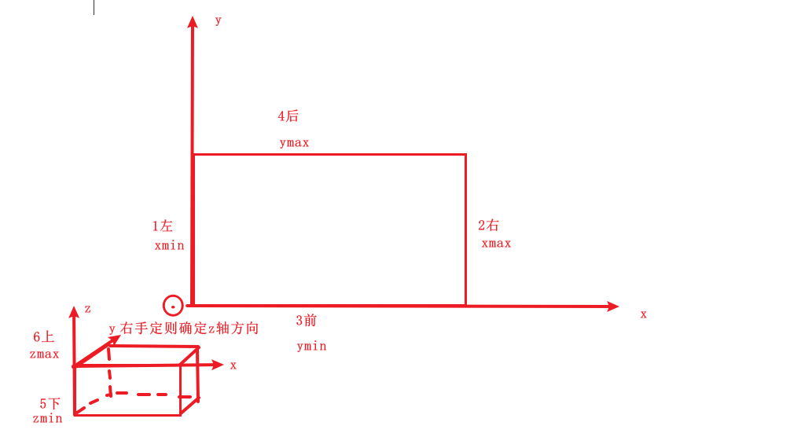

```c++
// 以xoy面为上下底,
// exp顺序为:左右前后下上, 与bound顺序一致,xmin, xmax, ymin, ymax, zmin, zmax
TopoDS_Shape shape = BRepPrimAPI_MakeBox(400, 250, 300);
TopExp_Explorer exp;
exp.Init(shape, TopAbs_FACE);
// ex.Current() = 左
exp.Next(); 
// ex.Current() = 右
exp.Next();
// ex.Current() = 前
exp.Next();
// ex.Current() = 后
exp.Next(); 
// ex.Current() = 下
exp.Next(); 
// ex.Current() = 上
```

